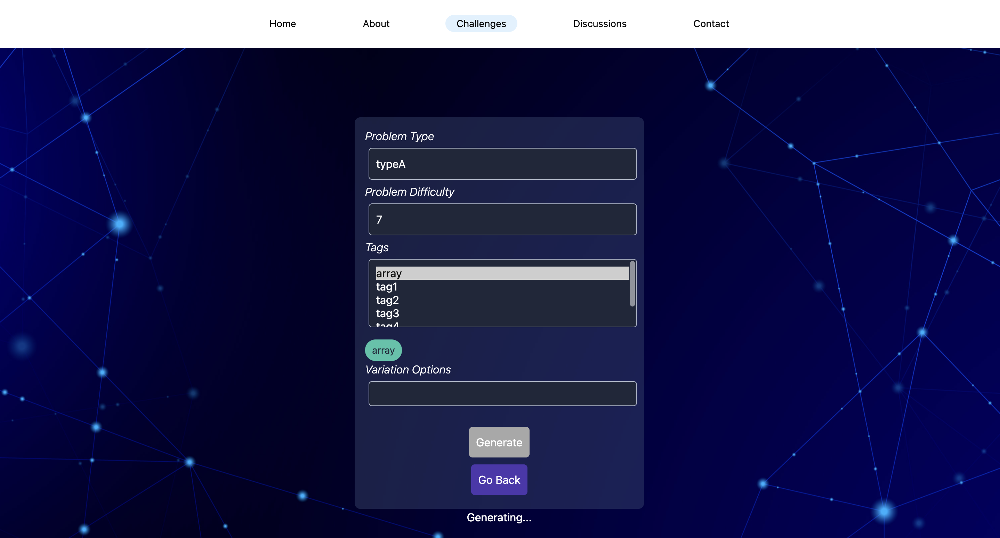
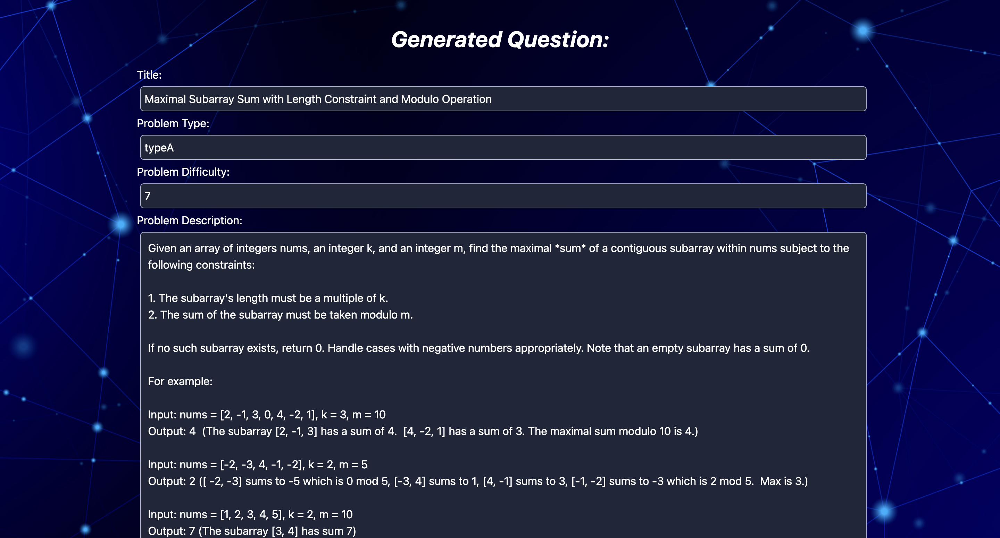
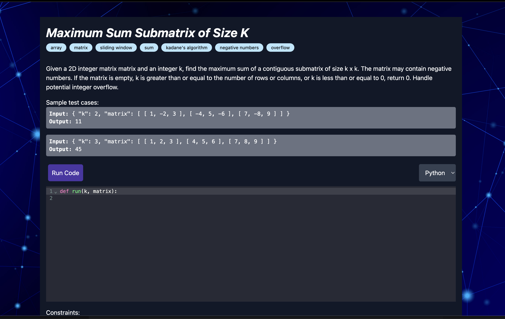
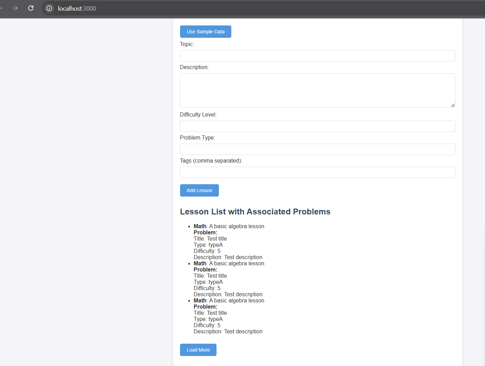
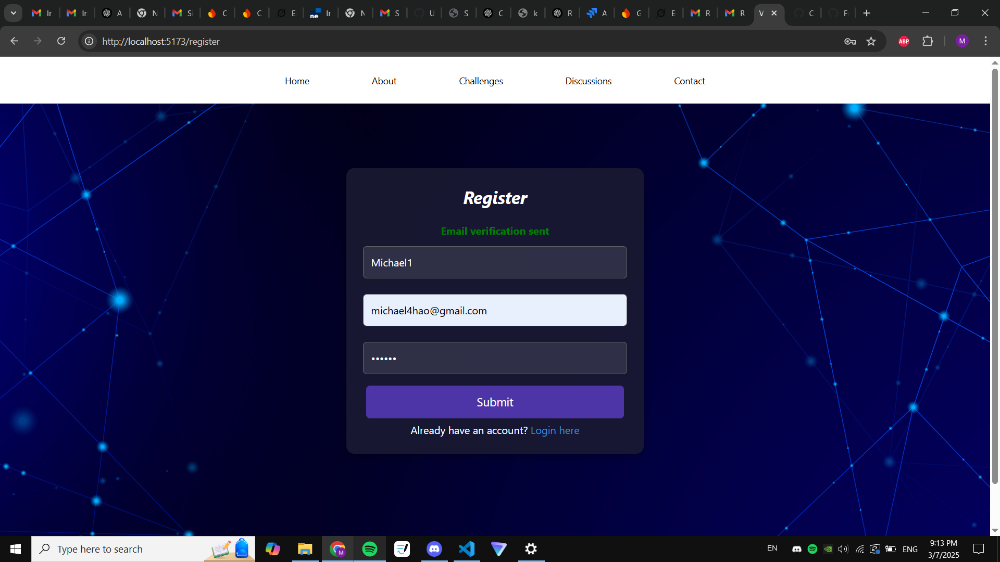
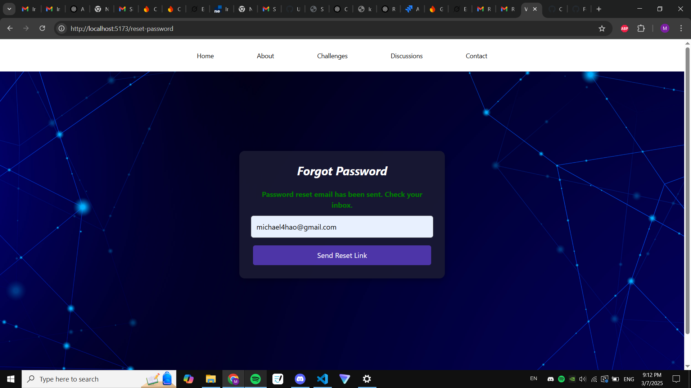

# CodeLingo

 > _Note:_ This document is meant to be written during (or shortly after) your review meeting, which should happen fairly close to the due date.      
 >      
 > _Suggestion:_ Have your review meeting a day or two before the due date. This way you will have some time to go over (and edit) this document, and all team members should have a chance to make their contribution.

## Iteration 01 - Review & Retrospect

 * When: 3/7/2025
 * Where: Online

## Process - Reflection

- Email verification, and reset password
- Code Editor
- Admin dashboard
- AI generated questions
- Added lessons to admin dashboard 
- Completed Sprint2 Docs

#### Decisions that turned out well

List process-related (i.e. team organization) decisions that, in retrospect, turned out to be successful.

- Team Work, Ethic, and Consistency: The way the project is organized and tasks are distributed among team members makes it extremely easy to develop the product.

- Making sure that each major feature or module had a designated owner helped avoid confusion, ensured accountability, and led to faster decision-making when changes or clarifications were needed.

#### Decisions that did not turn out as well as we hoped

List process-related (i.e. team organization) decisions that, in retrospect, were not as successful as you thought they would be.

- Expecting all developers to work the same way without considering their individual preferences and productivity habits often led to lower efficiency. Allowing some flexibility in workflows helped boost engagement and overall team performance.

- Lack of in-person discussion: We found it hard to find a time for the whole group to meet with each other in-person and discuss important factors of the project, which causes some miscommunications and slow project finalization speed.

#### Planned changes

List any process-related changes you are planning to make (if there are any)

None

## Product - Review

#### Goals and/or tasks that were met/completed:

- AI Generated Questions

- Code editor

- Added lessons to admin Dashboard

- Email verification, and reset password

- Completed Sprint2 documents

#### Goals and/or tasks that were planned but not met/completed:

- Uploading coding files to github

Going into the next iteration, our main insights are:

- Developing multiplayer aspect, (eg. trying to get users into the same session)

- Fully Integrating AI into lessons/problems

- Uploading coding files to github
